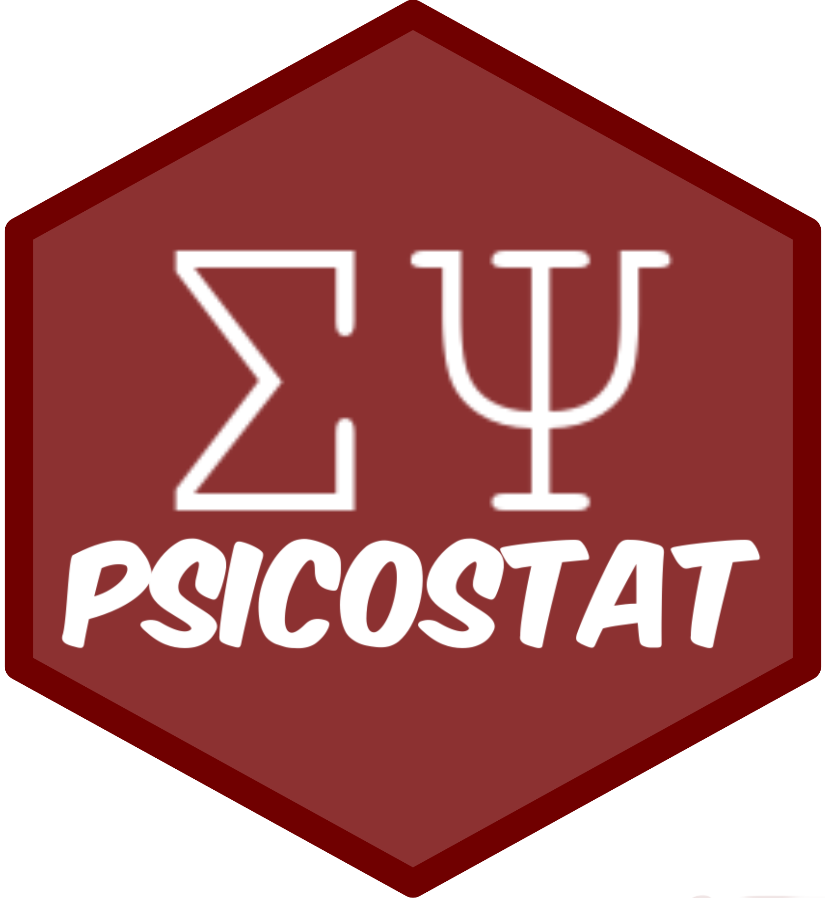

```{r setup, include=FALSE}
options(htmltools.dir.version = FALSE)
```

# About me

- `r emo::ji("university")` Sono uno **Psicologo** e **Dottorando** al Dipartimento di Psicologia dello Sviluppo e della Socializzazione. Lavoro con la *prof.ssa Paola Sessa* ed i *prof. Gianmarco Altoè* e *Massimiliano Pastore*.

- `r emo::ji("research")` Mi occupo di **elaborazione subliminale di stimoli in memoria**, **elaborazione di volti ed espressioni facciali** e dal punto di vista metodologico-statistico di **metanalisi**.

.pull-left[
.small[

Se volete contattarmi o vedere su cosa lavoro `r emo::ji("wink")`:
  - `r icons::fontawesome("github")` [filippogambarota](github.com/filippogambarota)
  - `r emo::ji("globe")` [filippogambarota.xyz](filippogambarota.xyz)
  - `r icons::academicons("google-scholar")` [Google Scholar](https://scholar.google.com/citations?user=f836QNAAAAAJ&hl=en)
  - `r icons::fontawesome("envelope")` [filippo.gambarota@phd.unipd.it](mailto:filippo.gambarota@phd.unipd.it)
  ]
]

.pull-right[

```{r, out.width="50%", echo=FALSE, fig.align='center'}

```
]

---

class: center, middle, inverse

# Qualche indicazione generale... `r emo::ji("wink")`

---

# Cosa faremo...

--

- **Lezioni** per rivedere/chiarire argomenti del corso

--

- **Lezioni** di approfondimento su argomenti extra riguardo R e l'analisi dati

--

- **Esercizi** sugli argomenti del corso. Se avete qualche richiesta possiamo focalizzarci su alcune cose in particolare.

--

Sono a disposizione per dubbi, domande e richieste varie. Non ci sono domande banali, approfittate di questo momento `r emo::ji("smile")`

---

class: center, middle, inverse

# Materiale `r emo::ji("book")`

---
# Materiale

--

- Su **Moodle** è disponibile una sezione chiamata **Didattica Integrativa** dedicata a questi incontri

--

- Le slide in `pdf` saranno caricate su Moodle **subito dopo** le lezioni. Siccome ci saranno diversi esercizi li risolviamo in "tempo reale"

--

- Una (fantastica `r emo::ji("wink")`) dispensa su R è disponibile qui [Introduction2R](https://psicostat.github.io/Introduction2R/)

--

- Altri materiali saranno disponibili (sempre anche su Moodle) in questa repository Github [didattica-testing-psicologico](https://github.com/filippogambarota/didattica-testing-psicologico)

---

class: center, middle, inverse

# In aula... `r emo::ji("school")`

---

# In aula `r emo::ji("school")`

- Cercate (se potete) di venire con il vostro `r emo::ji("pc")` in modo da poter fare esercizi insieme

- Tenetevi sempre aperta questa pagina [filippogambarota.github.io/didattica-testing-psicologico](https://filippogambarota.github.io/didattica-testing-psicologico) dove ci sono tutti i link e materiali (oltre a Moodle)

- Per gli esercizi, proviamo ad usare [https://textb.org/t/testing-psicologico/](https://textb.org/t/testing-psicologico/). E' un editor di testo condiviso dove possiamo scrivere insieme

- Se serve fare qualche schema o disegno, usiamo [Google Jamboard](https://jamboard.google.com/d/1poqrWpqQALHRby0xCtaDIzRsnuKksbYwC1XQ2vVnMRU/viewer) è una lavagna condivisa che potete sempre visualizzare

---

# Ricapitolando...

- Partecipate! è un momento di approfondimento che vi potrebbe essere utile per la tesi e per la vostra carriera universitaria
- Fate domande, provate a fare gli esercizi e proporre una soluzione e chiedete approfondimenti (sono qui apposta `r emo::ji("wink")`)

---

.middle-center[Problemi tecnici? `r emo::ji("wrench")`]

---
# Problemi tecnici? `r emo::ji("wrench")`

- Installazione di R ed R Studio https://psicostat.github.io/Introduction2R/install.html
- Errori su Windows/Linux/Mac?
- Problemi installazione pacchetti?