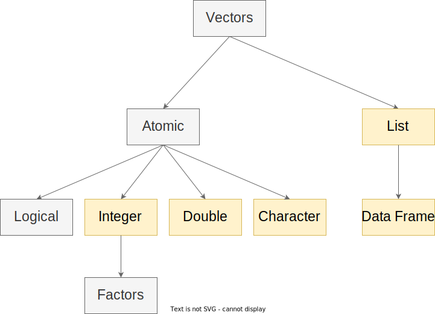

```{r setup, include=FALSE}
options(htmltools.dir.version = FALSE, max.print = 10)
knitr::opts_chunk$set(dev = 'svg') # set output device to svg
```

class: center, middle, inverse

# Organizzazione R ed R Studio

---

# Working Directory e Percorsi

Il nostro computer è composto da file e cartelle organizzati in modo **gerarchico** tra loro

.pull-left[

```
📦home
 ┣ 📂cartella1
 ┃ ┣ 📂cartella2
 ┃ ┃ ┗ 📜file1.txt
 ┃ ┗ 📜file1.txt
 ┣ 📜file1.txt
 ┗ 📜file2.txt
 
```

]

.pull-right[

```{r, out.width="100%", echo=FALSE}
knitr::include_graphics("img/wd.png")
```

]

---

# Working Directory e Percorsi

Nel momento in cui usiamo **R**, lui si colloca automaticamente in un dato percorso:

```{r}
getwd()
```

Noi possiamo modificare il collocamento di R usando il comando `setwd()`

```{r, eval=FALSE}
setwd("cartella/sub-cartella/...")
```

---
# Importare una funzione

In R tutto (vettore, dataframe, lista, etc.) è un oggetto, anche le funzioni. Per caricare una funzione salvata in un file `.R` possiamo usare il comando `source(file)`. Il file verrà caricato e tutto il codice lanciato. Se qualche oggetto o funzione è stato creato sarà disponibile globalmente:

```{r}
source("../../R/rsummary.R")
ls()
```
---

class: extra-section, center, middle

# Extra: R Projects

---
class: extra

# Extra: R Projects

Gli R Projects sono una funzionalità di R Studio e permettono di impostare automaticamente la **working directory** nella cartella dove è contenuto il file `*.Rproj`. In questo modo, ogni volta che R Studio viene aperto caricando un R Project, tutti i percorsi sono relativi alla *root* del progetto.

- [Video Tutorial](https://www.youtube.com/watch?v=MvdVqB5brZo) sui percorsi e R Projects

```{r, echo=FALSE, out.width="20%"}

```

---

class: center, middle, inverse

# Strutture dati

---
# Strutture dati

Le strutture dati sono modalità tramite cui un linguaggio di programmazione **organizza** tipologia e **struttura** dei vari tipi possibili di dato. Il vettore e la matrice sono delle strutture dati.

--

Aspetti principali di una struttura dati:

- presenza di **vincoli** (e.g., il vettore può essere solo numerico o di stringhe)
- presenza di **metodi** (i.e., funzioni) per **accedere**, **estrarre** e **modificare** i dati

---
# Strutture dati

Esiste una struttura dati che abbiamo sicuramente usato. Quale? `r emo::ji("thinking")`
--

```{r, echo = FALSE, out.width="90%"}
knitr::include_graphics("img/foglio_excel.png")
```

---
# Strutture dati in R

```{r, echo=FALSE, out.width="80%"}
knitr::include_graphics("img/data-structures.svg")
```

---
# Strutture dati in R

```{r, echo=FALSE, out.width="80%"}

```

---

class: center, middle, inverse

# Vettori

---

.middle-center[Dubbi/Domande? `r emo::ji("thinking")`]

---

# Esercizi

1.Create il seguente **vettore**:

```{r, echo=FALSE, results="asis"}
x <- seq(2, 10, 1.5)
cat(sprintf("$V = (%s)$", paste(x, collapse = ",")))
```

2.Create il seguente **vettore di caratteri**:

```{r, echo=FALSE, results="asis"}
x <- rep(c("x", "y", "z"), c(3, 2, 6))
cat(sprintf("$V = (%s)$", paste(x, collapse = ",")))
```

3.Create la seguente **matrice**:

$$
\begin{bmatrix}
3 & 5 & 11 \\
2 & 99 & 4 \\
2 & 55 & 100 \\
1 & 0 & 3 
\end{bmatrix}
$$

4.Data la matrice 3:

- accedere al numero di dimensioni
- accedere alla terza colonna
- accedere agli elementi $x_1 = [3, 1]$ e $x_2 = [4, 2]$

---

# Soluzioni

```{r}
seq(2, 10, 1.5)
```

```{r}
rep(c("x", "y", "z"), c(3, 2, 6))
```

```{r, error=TRUE}
mat <- matrix(data = c(3,5,11,2,99,4,2,55,100,1,0,3),
              nrow = 4,
              ncol = 3,
              byrow = TRUE)
dim(mat)
mat[3, 1]
mat[5, 2]
```

---

class: center, middle, inverse

# Liste

---
# Liste

In R la lista è la struttura dati più versatile (meno strutturata `r emo::ji("smile")`) e utile.

.pull-left[

```{r, echo=FALSE, out.width="80%"}
knitr::include_graphics("img/list_example.png")
```

]

.pull-right[

```{r, echo=FALSE, out.width="80%"}
knitr::include_graphics("img/list_depth.png")
```

]

---
# Liste

```{r, eval = FALSE}
list(elemento1, elemento2, elemento3) # lista normale
list(nome1 = elemento2, nome2 = elemento2, nome3 = elemento3) # lista named
```

```{r}
el1 <- runif(100)
el2 <- rep(letters[1:10], 3)
el3 <- iris
my_list <- list(vec1 = el1, vec2 = el2, data = el3)

names(my_list)
length(my_list)
str(my_list)
```

---
# Liste

Accediamo/modifichiamo gli elementi della lista:

```{r}
my_list$vec1 # con il dollaro + nome
my_list[1] # con la parentesi quadra
my_list[[1]] # con la doppia parentesi quadra
```

```{r, eval = FALSE}
my_list[[1]] <- nuovoelemento # sovrascrivo il primo elemento
my_list[[4]] <- nuovoelemento # aggiungo un elemento
my_list[[length(my_list) +  1]] <- nuovoelemento # più raffinato
my_list <- append(my_list, list(nuovoelemento)) # usando la funzione append
my_list <- c(my_list, list(nome = nuovoelemento)) # usando la funzione c
```

---

# Esercizi

1. Create una lista (usando dei nomi che volete) che contenga
  - una sequenza di 10 numeri partendo da 3 e incrementando di 1.33
  - le lettere dell'alfabeto (vedi `letters`) ripetute tutte 2 volte
  - il dataset `iris`
  - 100 numeri campionati da una distribuzione normale standard (vedi `rnorm`) $\mu = 0$ e $\sigma = 1$
2. Accedete al secondo elemento della lista
3. Aggiungete un quinto elemento con 10 numeri campionati da una distribuzione normale con $\mu = 10$ e $\sigma = 0$
4. Sostituite il terzo elemento con un'altra lista formata da un vettore numerico con i numeri da 1 a 30 e le prime 10 lettere dell'alfabeto

---

# Esercizi - Soluzioni

```{r}
my_list <- list(
  sequenza = seq(3, by = 1.33, length.out = 10),
  lettere = rep(letters, 2),
  iris = iris,
  normale01 = rnorm(100, mean = 0, sd = 1)
)

my_list[[2]]
my_list$lettere # se conosco il nome
my_list <- c(my_list, list(new_normale = rnorm(10, 10, 0)))
my_list[[3]] <- list(1:30, letters[1:10])
my_list[[3]]
```

---

class: center, middle, inverse

# Dataframe

---

.middle-center[Dubbi/Domande? `r emo::ji("thinking")`]

---
# Dataframe

--

- In R il dataframe è la struttura dati più utilizzata. Permette di organizzare dati, fare statistiche descrittive, fare analisi (come regressioni, t-test, etc.) e molte altre cose

--

- E' un tipo particolare di **lista** dove la lunghezza di ogni elemento è fissa (vincolo) portando ad una **struttura rettangolare**

--

- E' la *traduzione* in codice del foglio di calcolo Excel

---
# Dataframe

Ci sono diversi dataframe già presenti in R come oggetti. Vediamo quello più semplice ovvero `iris`:

```{r}
head(iris)
str(iris)
class(iris)
```

---
# Dataframe

Per accedere al dataframe usiamo un mix tra funzioni per le matrici (da cui prende la struttura rettangolare) e liste (da cui prende la flessibilità del tipo di dato):

```{r}
iris$Sepal.Length # prima colonna/elemento
iris[[1]] # prima colonna/elemento
iris[, 1] # prima colonna
```

---

class: extra-section, center, middle

# Extra: Importare dati

---
class: extra

# Importare dati

- La maggior parte delle analisi dati prevede di importare partendo da formati diversi (`xlsx`, `csv`, `sav`, `txt`, etc.) un dataset.
- Importare i dati è tutt'altro che banale e richiede una comprensione di come i vari formati codificano le informazioni fondamentali, in particolare la delimitazione dei valori
- `csv` ad esempio significa **c**omma **d**elimited **v**alues dove i valori sono delimitati da una virgola. R deve sapere il tipo di file e il delimitatore per leggere correttamente i dati

Per approfondire [questo documento](https://filippogambarota.github.io/corsoR/extra/importing_data.html) è una buona introduzione

---
class: inverse, center, middle

# Esempio

---

# Esempio

```{r}
# importiamo i dati
dat <- read.csv("../../data/pazienti.csv", sep = ",", header = TRUE, fileEncoding="UTF-8-BOM")

str(dat) # struttura
nrow(dat) # numero di righe (osservazioni)
ncol(dat) # numero di colonne (variabili)
colnames(dat) # nomi delle colonne (variabili)
```

---
# Esempio

Lavorare in un dataframe segue la stessa logica di un foglio excel. Possiamo **filtrare** le righe e/o colonne in funzione di determinate *condizioni*:

```{r}
# seleziono solo i pazienti con nevrosi e tutte le colonne
dat[dat$disturbo == "nevrosi", ]

# seleziono solo i pazienti con età maggiore di 30
dat[dat$eta > 30, ]

# seleziono i pazienti con ansia maggiore di 3 E provenienti dal veneto
dat[dat$ansia > 3 & dat$regione == "Veneto", ]
```

---

# Esercizi

1. Importa il dataframe `pazienti_sc.csv` (attenzione al *separatore*)
2. Estrai la struttura, il numero di colonne/righe
3. Estrai le righe 1, 10, 15, e 30
4. Estrai le righe da 1 a 15 e la 1 e 4 colonna
5. Estrai le osservazioni di pazienti provenienti dalla Liguria O dal Piemonte di classe sociale Alta e disturbi NON fobici
6. Estrai le osservazioni con età compresa tra 20 e 45 anni

---
# Soluzioni

```{r}
dat <- read.csv("../../data/pazienti_sc.csv", sep = ";", header = TRUE, fileEncoding="UTF-8-BOM") # importo

# struttura, righe e colonne
str(dat)
nrow(dat)
ncol(dat)
```

---
# Soluzioni

.small[

```{r}
dat[c(1, 10, 15, 30), ] # righe 1, 10, 15 e 30
dat[1:15, c(1, 4)] # righe 1:15 e colonna 1 e 4
dat[(dat$regione == "Liguria" | dat$regione == "Piemonte") & dat$cl.sociale == "Alta" & dat$disturbo != "fobico", ] # pazienti provenienti dalla Liguria O dal Piemonte di classe sociale Alta e disturbi NON fobici
dat[dat$eta > 20 & dat$eta < 45, ] # eta compresa tra 20 e 45
```
]

---

class: extra-section, center, middle

# Extra: Indicizzazione

---
class: extra

# Indicizzazione

Indicizzare una struttura dati è un'operazione fondamentale e complessa. Ma la logica sottostante è molto semplice. La sezione [10.2](https://psicostat.github.io/Introduction2R/dataframe.html#sel-df) del libro `Introduction2R` è un buon riferimento.

Il segreto è capire come funzionano le *operazioni logiche* ad esempio `dat$eta > 30` e come si concatenano tra loro

---
class: extra

# Indicizzazione logica

Indicizzare con la posizione è l'aspetto più semplice e intuitivo. E' possibile anche selezionare tramite valori `TRUE` e `FALSE`. L'idea è che se abbiamo un vettore di lunghezza *n* e un'altro vettore logico di lunghezza *n*, tutti gli elementi `TRUE` saranno selezionati:

```{r}
my_vec <- 1:10
my_selection <- sample(rep(c(TRUE, FALSE), each = 5)) # random TRUE/FALSE
my_selection
my_vec[my_selection]
```

---
class: extra

# Indicizzazione logica

Chiaramente non è pratico costruire a mano i vettori logici. Infatti possiamo usare delle *espressioni relazionali* per selezionare elementi:

```{r}
my_vec <- 1:10
my_selection <- my_vec < 6
my_vec[my_selection]
my_vec[my_vec < 6] # in modo più compatto
```

---
class: extra

# Indicizzazione logica

Chiaramente possiamo usare **espressioni di qualsiasi complessità** perchè essenzialmente abbaimo bisogno di un vettore `TRUE/FALSE`:

```{r}
my_vec <- 1:10
my_selection <- my_vec < 2 | my_vec > 8
my_vec[my_selection]
my_vec[my_vec < 2 | my_vec > 8] # in modo più compatto
```

---
class: extra

# Indicizzazione intera `which()`

La funzione `which()` è molto utile perchè restituisce la **posizione** associata ad una selezione logica:

```{r}
my_vec <- rnorm(10)
which(my_vec < 0.5)

# Questo

my_vec[which(my_vec < 0.5)]

# e questo sono equivalenti

my_vec[my_vec < 0.5]
```

---
class: extra

# Indicizzazione dataframe

E' importante capire che a prescindere dalla complessità della struttura dati (vettore vs dataframe) quando selezioniamo delle righe/colonne non facciamo altro che *combinare operazioni logiche*, ottenere un vettore di `TRUE`/`FALSE` o di `interi` e con questo vettore indicare quali righe/colonne selezionare.

```{r}
# età > 30 e regione veneto
my_sel_log <- dat$eta > 30 & dat$regione == "Veneto"
my_sel_log # vettore logico TRUE/FALSE
my_sel_int <- which(my_sel_log) # vettore di interi

dat[my_sel_log, ] # selezione logica
dat[my_sel_int, ] # selezione intera
```

---

class: inverse, center, middle

# EDA - Exploratory Data Analysis

---

# Nuove colonne

Possiamo aggiungere nuove informazioni (colonne) per aggiungere informazioni o modificare quelle esistenti:

```{r}
# aggingiamo una colonna che indica alta o bassa ansia basandoci su un cut-off di 4
dat$ansia_cut <- ifelse(dat$ansia > 4, yes = "alta", no = "bassa")

# convertiamo la classe sociale in un fattore ordinato (scala ordinale)
dat$cl.sociale <- factor(dat$cl.sociale, ordered = TRUE)

str(dat)
```

---
# Esplorazione

Ogni tipo di variabile è associata a determinate statistiche descrittive (e.g., *media* vs *frequenza*) e rappresentazioni grafiche (e.g., *barplot* vs *boxplot*).

- ha senso calcolare la media della variabile `disturbo`?
- ha senso calcolare le frequenze della variabile `ansia`?

---
# Esplorazione

Facciamo un istogramma per le variabili numeriche:

```{r, fig.width=10, fig.height=5}
par(mfrow = c(1,2))
hist(dat$eta, col = "lightblue")
hist(dat$ansia, col = "pink")
```

---
# Esplorazione

Facciamo un grafico a barre per le variabili categoriali/ordinali

```{r, fig.width=10, fig.height=5}
par(mfrow = c(1,2))
barplot(table(dat$cl.sociale), col = "lightgreen")
barplot(table(dat$disturbo), col = "firebrick2")
```

---
# Explorazione - Grafici bi-variati

Possiamo vedere la distribuzione di una variabile numerica *in funzione* di una categoriale:

```{r, fig.width=10, fig.height=5}
par(mfrow = c(1,2))
boxplot(ansia ~ disturbo, data = dat, col = c("salmon", "lightgreen", "lightblue", "pink"))
boxplot(ansia ~ cl.sociale, data = dat)
```

---
# Esplorazione - Grafici bi-variati

Possiamo anche vedere la distribuzione di due variabili categoriali facendo un barplot ed una tabella di contingenza:

```{r, fig.width=10, fig.height=5}
barplot(table(dat$cl.sociale, dat$disturbo), col = c("salmon", "lightgreen", "lightblue"))
legend("topright", legend=unique(dat$cl.sociale), pch=16, col = c("salmon", "lightgreen", "lightblue"))
```


