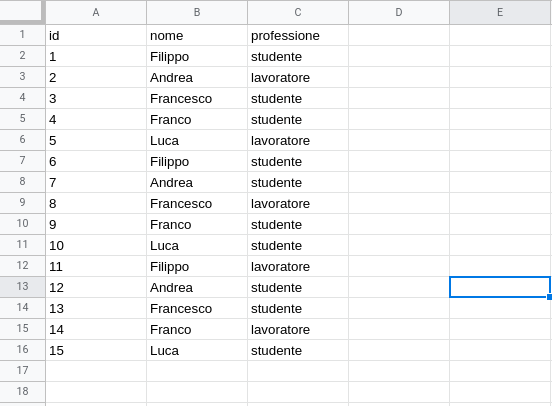

```{r setup, include=FALSE}
options(htmltools.dir.version = FALSE, max.print = 10)
knitr::opts_chunk$set(dev = 'svg') # set output device to svg
devtools::load_all()
```

class: center, middle, inverse

# Organizzazione R ed R Studio

---

# Working Directory e Percorsi

Il nostro computer è composto da file e cartelle organizzati in modo **gerarchico** tra loro

.pull-left[

```
📦home
 ┣ 📂cartella1
 ┃ ┣ 📂cartella2
 ┃ ┃ ┗ 📜file1.txt
 ┃ ┗ 📜file1.txt
 ┣ 📜file1.txt
 ┗ 📜file2.txt
 
```

]

.pull-right[

```{r, out.width="100%", echo=FALSE}

```

]

---

# Working Directory e Percorsi

Nel momento in cui usiamo **R**, lui si colloca automaticamente in un dato percorso:

```{r}
getwd()
```

Noi possiamo modificare il collocamento di R usando il comando `setwd()`

```{r, eval=FALSE}
setwd("cartella/sub-cartella/...")
```

---

class: extra-section, center, middle

# Extra: R Projects

---
class: extra

# Extra: R Projects

Gli R Projects sono una funzionalità di R Studio e permettono di impostare automaticamente la **working directory** nella cartella dove è contenuto il file `*.Rproj`. In questo modo, ogni volta che R Studio viene aperto caricando un R Project, tutti i percorsi sono relativi alla *root* del progetto.

- [Video Tutorial](https://www.youtube.com/watch?v=MvdVqB5brZo) sui percorsi e R Projects

```{r, echo=FALSE, out.width="50%", fig.align='center'}
knitr::include_graphics("img/rproj1.png")
```

---
class: extra

# Organizziamo la cartella...

Create un R Project chiamato `testing-psicologico` dentro una cartella chiamata `testing-psicologico` con la seguente struttura:

.pull-left[

```
📦testing-psicologico
 ┣ 📂R
 ┣ 📂data
 ┣ 📂esercizi
 ┣ 📂scripts
 ┗ 📜testing-psicologico.Rproj
```

]

.pull-right[

1. create il progetto R
2. scaricate la cartella `data` da questo link
3. scaricate la cartella `scripts` da questo link
4. scaricate la cartella `R` da questo link
5. create una cartella `esercizi`

]

---

class: inverse, center, middle

# R comandi di base

---
# Oggetti

> Everything that exists in R is an object - John M. Chambers

Tutto quello che **creiamo** in R (vettori, matrici, funzioni, variabili, etc.) sono considerati come oggetti:

```{r}
x <- 10
y <- 1:10
z <- "ciao"
f <- function(x) x + 3
class(x)
class(z)
class(f)
```

---
# Funzioni

> Everything that happens in R is the result of a function call - John M. Chambers

Tutto quello che **eseguiamo** in R è il risultato di una funzione:

```{r, eval = TRUE}
seq(1, 10, 1)
c(1,2,3)
`+`(3, 2) # equivale a 3 + 2
`<-`(ciao, 2) # equivale a ciao <- 2
ciao
```

---
# Importare una funzione

In R tutto (vettore, dataframe, lista, etc.) è un oggetto, anche le funzioni. Per caricare una funzione salvata in un file `.R` possiamo usare il comando `source(file)`. Il file verrà caricato e tutto il codice lanciato. Se qualche oggetto o funzione è stato creato sarà disponibile globalmente:

```{r}
source("../../R/rsummary.R")
ls()
```
---

class: center, middle, inverse

# Strutture dati

---
# Strutture dati

Le strutture dati sono modalità tramite cui un linguaggio di programmazione **organizza** tipologia e **struttura** dei vari tipi possibili di dato. Il vettore e la matrice sono delle strutture dati.

--

Aspetti principali di una struttura dati:

- presenza di **vincoli** (e.g., il vettore può essere solo numerico o di stringhe)
- presenza di **metodi** (i.e., funzioni) per **accedere**, **estrarre** e **modificare** i dati

---
# Strutture dati

Esiste una struttura dati che abbiamo sicuramente usato. Quale? `r emo::ji("thinking")`
--

```{r, echo = FALSE, out.width="90%"}

```

---
# Strutture dati in R

```{r, echo=FALSE, out.width="80%"}

```

---
# Strutture dati in R

```{r, echo=FALSE, out.width="80%"}
knitr::include_graphics("img/data-structures-hs.svg")
```

---

class: center, middle, inverse

# Vettori

---

.middle-center[Dubbi/Domande? `r emo::ji("thinking")`]

---
# Piccolo ripasso...

--

- Il vettore è una struttura **unidimensionale**, che contiene **un solo tipo** di dato. Le proprietà fondamentali sono la tipologia (`str(vettore)`) e la sua lunghezza (`length(vettore)`)

--

- Ogni elemento (a prescindere dalla tipologia) è indicizzato partendo da 1 fino alla lunghezza del vettore $n$

--

```{r, echo=FALSE}
knitr::include_graphics("img/vector.png")
```

---
class: inverse, center, middle

# Indicizzazione Vettori

---
# Indicizzazione Vettori

Indicizzare una struttura dati è un'operazione fondamentale e complessa. Ma la logica sottostante è molto semplice. La sezione [10.2](https://psicostat.github.io/Introduction2R/dataframe.html#sel-df) del libro `Introduction2R` è un buon riferimento.

--

Il modo più semplice è quello di usare l'**indice di posizione**

```{r}
my_vec <- 1:10
my_vec[1] # primo elemento
my_vec[2:5] # dal secondo al 5
my_vec[length(my_vec)] # ultimo elemento
```

---
# Indicizzazione logica

Indicizzare con la posizione è l'aspetto più semplice e intuitivo. E' possibile anche selezionare tramite valori `TRUE` e `FALSE`. L'idea è che se abbiamo un vettore di lunghezza *n* e un'altro vettore logico di lunghezza *n*, tutti gli elementi `TRUE` saranno selezionati:

```{r}
my_vec <- 1:10
my_selection <- sample(rep(c(TRUE, FALSE), each = 5)) # random TRUE/FALSE
my_selection
my_vec[my_selection]
```

---
# Indicizzazione logica

Chiaramente non è pratico costruire a mano i vettori logici. Infatti possiamo usare delle *espressioni relazionali* per selezionare elementi:

```{r}
my_vec <- 1:10
my_selection <- my_vec < 6
my_vec[my_selection]
my_vec[my_vec < 6] # in modo più compatto
```

---
# Indicizzazione logica

Chiaramente possiamo usare **espressioni di qualsiasi complessità** perchè essenzialmente abbaimo bisogno di un vettore `TRUE/FALSE`:

```{r}
my_vec <- 1:10
my_selection <- my_vec < 2 | my_vec > 8
my_vec[my_selection]
my_vec[my_vec < 2 | my_vec > 8] # in modo più compatto
```

---
# Indicizzazione intera `which()`

La funzione `which()` è molto utile perchè restituisce la **posizione** associata ad una selezione logica:

```{r}
my_vec <- rnorm(10)
which(my_vec < 0.5)

# Questo

my_vec[which(my_vec < 0.5)]

# e questo sono equivalenti

my_vec[my_vec < 0.5]
```

---
# Indicizzazione negativa

Possiamo anche escludere degli elementi sia usando l'indicizzazione *logica* che quella *intera*:

```{r}
my_vec[-c(1, 5, 7)] # escludo gli elementi alla posizione 1, 5 e 7
my_vec[!my_vec > 0.5] # escludo gli elementi > di 0.5
```

Ovviamente assegnando il risultato `<-` delle operazioni precedenti ad un nuovo oggetto o allo stesso creiamo un subset del vettore iniziale

```{r}
my_vec_new <- my_vec[-c(1, 5, 7)] # escludo gli elementi alla posizione 1, 5 e 7
my_vec_new
```

---
# Sostituire

Possiamo anche *sovrascrivere* degli elementi di un vettore ancora utilizzando sia l'indicizzazione *logica* che quella *intera*:

```{r}
my_vec_new <- my_vec # creo un nuovo vettore per fare queste operazioni
my_vec_new[my_vec_new > 0.5] <- 999
my_vec_new

my_vec_new <- my_vec # creo un nuovo vettore per fare queste operazioni
my_vec_new[c(1,2,5)] <- 888
my_vec_new

my_vec_new <- my_vec # creo un nuovo vettore per fare queste operazioni
my_vec_new[2] <- "ciao"
my_vec_new  # cosa notate?
```

---

# Esercizi

1.Create il seguente **vettore** `r sprintf("$V = (%s)$", paste(seq(2, 10, 1.5), collapse = ","))`

2.Create il seguente **vettore di caratteri** `r sprintf("$V = (%s)$", paste(rep(c("x", "y", "z"), c(3, 2, 6)), collapse = ","))`

3.Create un vettore (`vec_let`) di caratteri con 30 lettere random dell'alfabeto (vedi il comando `sample()` ed l'oggetto `letters`) usando però solo le prime 5
  1. selezionate solo le lettere "a"
  2. selezionate solo le lettere "a", "b" e "c"
  3. selezionate tutte le lettere TRANNE la "a"

4.Create un vettore (`vec_int`) di 50 elementi con numeri casuali (**interi**) con un range tra 20 e 150 (vedi il comando `runif` e cerca di capire come trasformarli in interi):
  - selezionare tutti i numeri > 50
  - selezionare tutti i numeri < 100
  - selezionare i numeri che occupano posizioni in sequenza di 2. Ad esempio $x = [10, 30, 40, 2, 3, 1]$, seleziono $[30, 2, 1]$
  - seleziono tutti i numeri pari (vedi l'operatore modulo ?`%%`) E minori di 100
  
---

`r ifelse(params$solutions, "# Soluzioni", "# No solutions here 😱")`

```{r include=!params$solutions, results='asis', out.width="80%", fig.align='center', echo=FALSE}
solutions_meme()
```

```{r include=params$solutions}
seq(2, 10, 1.5) # 1

rep(c("x", "y", "z"), c(3, 2, 6)) # 2

vec_let <- sample(x = letters[1:5], size = 30, replace = TRUE) # 3, cosa fa replace?
vec_let
vec_let[vec_let == "a"] # 3.1
vec_let[vec_let == "a" | vec_let == "b" | vec_let == "c"] # 3.2 oppure vec_let[vec_let %in% c("a", "b", "c")]
```

---
`r ifelse(params$solutions, "# Soluzioni", "# No solutions here 😱")`

```{r include=!params$solutions, results='asis', out.width="80%", fig.align='center', echo=FALSE}
solutions_meme()
```

```{r include=params$solutions}
vec_let[vec_let != "a"] # 3.3
vec_int <- round(runif(n = 50, min = 20, max = 150), 0) # 4 vedi anche as.integer()
vec_int
vec_int[vec_int > 50] # 4.1
vec_int[vec_int < 100] # 4.2
```

---
`r ifelse(params$solutions, "# Soluzioni", "# No solutions here 😱")`

```{r include=!params$solutions, results='asis', out.width="80%", fig.align='center', echo=FALSE}
solutions_meme()
```

```{r, include=params$solutions}
vec_int[seq(2, 50, 2)] # 4.3 # indicizzazione intera
vec_int[vec_int %% 2 == 0 & vec_int < 100] # 4.4
```

---
# Esercizi (Advanced)<sup>1</sup>

1. Si utilizzi il comando letters, con gli opportuni indici, per produrre le seguenti parole: (tip: vedete il comando `match()` per trovare gli indici)
  - albero, cane, ermeneutica, orologio, patologico
  
2. Quando abbiamo un dataset e dati sensibili spesso è utile generare un codice identificativo unico per ogni soggetto. Create un codice identificativo unico in questo modo "id_3numericasuali_4letterecasuali" (vedi il comando `sample()`) ad esempio `1_324_aeiz`. Per farlo usate il comando `paste0()` (veramente molto utile).

3. Usando lo stesso approccio, componiamo i nostri identificativi basandoci su informazioni già presenti. Copiate e incollate il codice qui sotto e create gli identificativi in questo modo `id_mesenascita_annonascita`:

```{r}
id <- 1:20
mese <- sample(1:12, 20, replace = TRUE)
anno <- round(runif(20, 1994, 2002))
```


.footnote[
[1] Thanks to Professor Massimiliano Pastore `r emo::ji("smile")`
]

---
`r ifelse(params$solutions, "# Soluzioni", "# No solutions here 😱")`

```{r include=!params$solutions, results='asis', out.width="80%", fig.align='center', echo=FALSE}
solutions_meme()
```

```{r include=params$solutions}
# il segreto è usare il comando match e selezionare le lettere dalla lista
word <- c("a", "l", "b", "e", "r", "o")
match(word, letters)
letters[match(word, letters)]

# il comando paste0() incolla delle stringhe insieme per comporre delle nuove stringhe

numeri <- paste0(sample(0:9, 3, replace=TRUE), collapse = "")
lettere <- paste0(sample(letters, 3, replace=TRUE), collapse = "")
paste0("1_", numeri, "_", lettere)

codice <- paste0(id, "_", mese, "_", anno) # il comando paste è vettorizzato quindi funziona anche su vettori con più elementi
codice
```

---
class: extra-section, center, middle

# Extra - Manipolazione Avanzata Vettori

---
class: extra

# Ricodifica

- Spesso abbiamo bisogno non solo di accedere/selezionare ma di **modificare** in modo condizionale gli elementi di un vettore
- Quando facciamo lo *scoring* dei questionari (lo vedrete più avanti) alcuni elementi delle risposte devono essere cambiate
- Ad esempio, **invertire** i valori delle risposte per alcuni item: 1 --> 5, 2 --> 4, 3 --> 3, 4 --> 2, 5 --> 1
- Si può fare manualmente (`r emo::ji("scream")`) in Excel o in modo più robusto in R

```{r}
item1 <- sample(1:5, 30, replace = TRUE)
item1
```

---
# Ricodifica

Il principio è quello della selezione/sostituzione logica ma ci serve un modo più compatto

```{r, eval = FALSE}
item1[item1 == 1] <- 5
item1[item1 == 2] <- 4
item1[item1 == 3] <- 3
item1[item1 == 4] <- 2
item1[item1 == 5] <- 1
```

Funziona? Vedete alcuni problemi? Provate a utilizzarlo...

---
# Ricodifica

Problema 1: Lungo e ripetitivo da scrivere, sopratutto se dobbiamo cambiare molti valori

Problema 2: Deve essere eseguito in **parallelo** altrimenti il risultato è sbagliato (2 diventa 4 ma poi ritorna 2)

---
# Ricodifica - `car::recode()`

Il pacchetto `car` ha una funzione `recode` che esegue esattamente questa operazione `recode(vettore, c("old = new", ...))`

```{r}
car::recode(item1, "1=5; 2=4; 3=3; 4=2; 5=1")
```

---
# Ricodifica - `dplyr::case_when()`

Il pacchetto `dplyr` ha una funzione `case_when()` che in modo più intuitivo ricodifica un vettore:

```{r}
dplyr::case_when(item1 == 1 ~ 5,
                 item1 == 2 ~ 4,
                 item1 == 3 ~ 3,
                 item1 == 4 ~ 2,
                 item1 == 5 ~ 1)
```