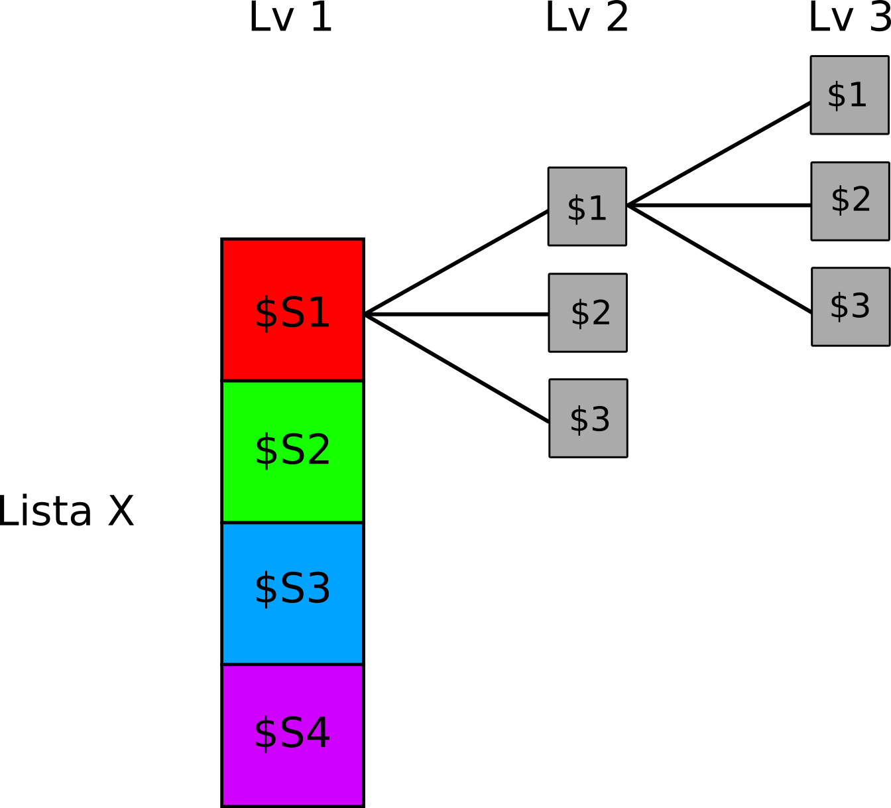
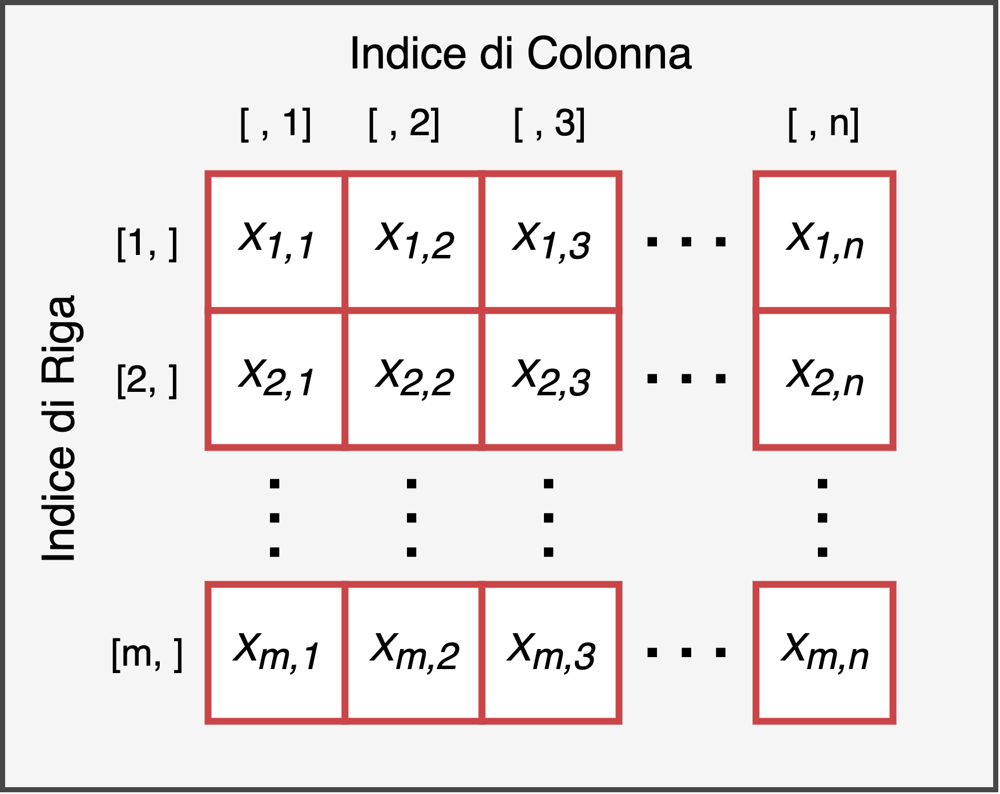

```{r setup, include=FALSE}
options(htmltools.dir.version = FALSE, max.print = 10)
knitr::opts_chunk$set(dev = 'svg') # set output device to svg
devtools::load_all()
```

---

class: center, middle, inverse

# Liste

---
# Piccolo ripasso...

In R la lista è la struttura dati più versatile (meno strutturata `r emo::ji("smile")`) e utile.

.pull-left[

```{r, echo=FALSE, out.width="80%"}
knitr::include_graphics("img/list_example.png")
```

]

.pull-right[

```{r, echo=FALSE, out.width="80%"}

```

]

---
# Piccolo ripasso...

```{r, eval = FALSE}
list(elemento1, elemento2, elemento3) # lista normale
list(nome1 = elemento2, nome2 = elemento2, nome3 = elemento3) # lista named
```

```{r}
el1 <- runif(100)
el2 <- rep(letters[1:10], 3)
el3 <- iris
my_list <- list(vec1 = el1, vec2 = el2, data = el3)

names(my_list)
length(my_list)
str(my_list)
```

---
# Liste

Accediamo/modifichiamo gli elementi della lista:

```{r}
my_list$vec1 # con il dollaro + nome
my_list[1] # con la parentesi quadra
my_list[[1]] # con la doppia parentesi quadra
```

```{r, eval = FALSE}
my_list[[1]] <- nuovoelemento # sovrascrivo il primo elemento
my_list[[4]] <- nuovoelemento # aggiungo un elemento
my_list[[length(my_list) +  1]] <- nuovoelemento # più raffinato
my_list <- append(my_list, list(nuovoelemento)) # usando la funzione append
my_list <- c(my_list, list(nome = nuovoelemento)) # usando la funzione c
```

---

# Esercizi

1. Create una lista *named* che contenga
  - una sequenza di 20 numeri partendo da 3 e incrementando di 1.33 [elemento chiamato `el1`]
  - le lettere dell'alfabeto (vedi `letters`) ripetute tutte 2 volte [elemento chiamato `el2`]
  - 100 numeri casuali tra 1 e 100 (vedi il comando `runif`) [elemento chiamato `el3`]
2. Accedete al secondo elemento della lista
3. Aggiungete un quarto elemento con 10 numeri casuali da 1 a 100 (vedi `runif`)
4. Sostituite il terzo elemento con un'altra lista (lista nested) formata da 2 elementi:
    - un vettore numerico con i numeri da 1 a 30
    - le prime 10 lettere dell'alfabeto
    
---

`r ifelse(params$solutions, "# Soluzioni", "# No solutions here 😱")`

```{r include=!params$solutions, results='asis', out.width="80%", fig.align='center', echo=FALSE}
solutions_meme()
```

```{r include=params$solutions}
# 1
my_list <- list(
  sequenza = seq(3, by = 1.33, length.out = 10),
  lettere = rep(letters, 2),
  iris = iris,
  normale01 = rnorm(100, mean = 0, sd = 1)
)

# 2
my_list[[2]]

# 2
my_list$lettere # se conosco il nome

# 3
my_list <- c(my_list, list(new_normale = rnorm(10, 10, 0)))
```

---

`r ifelse(params$solutions, "# Soluzioni", "# No solutions here 😱")`

```{r include=!params$solutions, results='asis', out.width="80%", fig.align='center', echo=FALSE}
solutions_meme()
```

```{r include=params$solutions}
# 4
my_list[[3]] <- list(1:30, letters[1:10])
my_list[[3]]
str(my_list)
```

---

class: center, middle, inverse

# Matrici

---

.middle-center[Dubbi/Domande? `r emo::ji("thinking")`]

---
# Piccolo ripasso...

- Le matrici sono una struttura dati **bidimensionale** che contengono **una sola tipologia** di elementi
- Le proprietà fondamentali sono la tipologia (`str(matrice)`) e le dimensioni (`dim(matrice)`, `ncol(matrice)`, `nrow(matrice)`)

```{r, out.width="60%", echo=FALSE, fig.align='center'}

```

---

class: inverse, center, middle

# Indicizzazione Matrici

---
# Indicizzazione Matrici

- Le matrici seguono la stessa logica dei vettori in termini di indicizzazione con la differenza di ragionare in modo bidimensionale $[righe, colonne]$
- Possiamo però anche usare l'indicizzazione logica e ovviamente intera

```{r}
mat <- matrix(data = sample(1:30, 25, replace = TRUE),
              nrow = 5,
              ncol = 5,
              byrow = TRUE)
mat > 10 # tutti i numeri > 10
mat == 10 # tutti i numeri uguali a 10
```

---
# Indicizzazione Matrici

Possiamo quindi usare questa matrice logica (come con il vettore logico) per selezionare gli elementi:

```{r}
mat[mat > 10]
mat[mat == 10]
```

---
# Indicizzazione Matrici

Come vedete il risultato è un *vettore*. In pratica è come *srotolare* la matrice e poi trattarla esattamente come un vettore:

```{r}
matv <- c(mat) # la funzione c permette di srotolare la matrice, anche con as.vector(mat)
matv
matv[matv > 10] # equivalente a mat[mat > 10]
```

---
class: font90

# Matrici - Esercizi

1.Create la seguente **matrice**:

$$
\begin{bmatrix}
3 & 5 & 11 \\
2 & 99 & 4 \\
2 & 55 & 100 \\
1 & 0 & 3 
\end{bmatrix}
$$

2.Data la matrice 1:

  - accedere al numero di dimensioni
  - accedere alla terza colonna
  - accedere agli elementi $x_1 = [3, 1]$ e $x_2 = [4, 2]$, cosa notate?
  - estraete dalla matrice tutti i numeri maggiori di 50
  - estraete dalla matrice tutti i numeri pari (vedi l'operatore `%%`)
  - sostituite tutti gli elementi dispari con il numero 0
  - aggiungete una colonna con i numeri $[1, 2, 3, 4]$
  - togliete la colonna 2

3.Creare la seguente **matrice**, cosa notate?

$$
\begin{bmatrix}
a & b & 11 \\
1 & 22 & 4 \\
4 & 55 & h \\
1 & d & 3 
\end{bmatrix}
$$
4.Create una matrice formata da 30 lettere dell'alfabeto in modo random (vedi il comando `sample()` e l'oggetto `letters`) con numero di righe e colonne a vostra scelta. cosa notate rispetto alla matrice 1?

---

`r ifelse(params$solutions, "# Soluzioni", "# No solutions here 😱")`

```{r include=!params$solutions, results='asis', out.width="80%", fig.align='center', echo=FALSE}
solutions_meme()
```

```{r error = TRUE, eval=params$solutions, include=params$solutions}
# 1
mat <- matrix(data = c(3,5,11,2,99,4,2,55,100,1,0,3),
              nrow = 4,
              ncol = 3,
              byrow = TRUE)

# 2
dim(mat)
mat[, 3] # mat[1:4, ], cosa cambia?
mat[3, 1]
mat[5, 2]
```

---

`r ifelse(params$solutions, "# Soluzioni", "# No solutions here 😱")`

.font90[

```{r include=!params$solutions, results='asis', out.width="80%", fig.align='center', echo=FALSE}
solutions_meme()
```

```{r include=params$solutions}
# ..2
mat[mat > 50]
mat[mat %% 2 == 0]
mat[mat %% 2 != 0] <- 0
mat <- cbind(mat, c(1, 2, 3, 4))
mat[, -2]

# 3
mat2 <- matrix(c("a", "b", 11, 1, 22, 4, 4, 55, "h", 1, "d", 3),
               nrow = 4,
               byrow = TRUE)
mat2
```

]

---

`r ifelse(params$solutions, "# Soluzioni", "# No solutions here 😱")`

```{r include=!params$solutions, results='asis', out.width="80%", fig.align='center', echo=FALSE}
solutions_meme()
```

```{r eval = params$solutions, include=params$solutions, error = TRUE}
# 4
mat3 <- matrix(sample(letters, 30, replace = TRUE),
               nrow = 6,
               ncol = 5)
mat3
mat3 + 2
mat3 * 2
mat3 == "a"

```

---
class: inverse, center, middle

# Dataframe

---

# Piccolo ripasso...

--

- Il dataframe è una struttura dati **bidimensionale** (come la matrice), può contenere **più tipologie di dati** (come la lista)

--

- E' un tipo particolare di **lista** dove la **lunghezza** di ogni elemento è fissa (vincolo) portando ad una **struttura rettangolare**

--

- E' la *traduzione* in codice del foglio di calcolo Excel

---
# Piccolo ripasso...

Ci sono diversi dataframe già presenti in R come oggetti. Vediamo quello più semplice ovvero `iris`:

```{r}
head(iris)
str(iris)
class(iris)
```

---
# Piccolo ripasso...

Per accedere al dataframe usiamo un mix tra funzioni per le matrici (da cui prende la struttura rettangolare) e liste (da cui prende la flessibilità del tipo di dato):

```{r}
iris$Sepal.Length # prima colonna/elemento
iris[[1]] # prima colonna/elemento
iris[, 1] # prima colonna
```

---
class: inverse, center, middle

# Indicizzazione dataframe

---

# Indicizzazione dataframe

E' importante capire che a prescindere dalla complessità della struttura dati (vettore vs dataframe) quando selezioniamo delle righe/colonne non facciamo altro che *combinare operazioni logiche*, ottenere un vettore di `TRUE`/`FALSE` o di `interi` e con questo vettore indicare quali righe/colonne selezionare.

```{r}
my_sel_log <- iris$Species == "Setosa"
my_sel_log # vettore logico TRUE/FALSE
my_sel_int <- which(my_sel_log) # vettore di interi

iris[my_sel_log, ] # selezione logica
iris[my_sel_int, ] # selezione intera
```

---

class: extra-section, center, middle

# Extra: Importare dati

---
class: extra

# Importare dati

- La maggior parte delle analisi dati prevede di importare partendo da formati diversi (`xlsx`, `csv`, `sav`, `txt`, etc.) un dataset.
- Importare i dati è tutt'altro che banale e richiede una comprensione di come i vari formati codificano le informazioni fondamentali, in particolare la delimitazione dei valori
- `csv` ad esempio significa **c**omma **d**elimited **v**alues dove i valori sono delimitati da una virgola. R deve sapere il tipo di file e il delimitatore per leggere correttamente i dati

Per approfondire [questo documento](https://filippogambarota.github.io/corsoR/extra/importing_data.html) è una buona introduzione

---
class: inverse, center, middle

# Esempio

---

# Esempio

```{r}
# importiamo i dati
dat <- read.csv("../../data/pazienti.csv", sep = ",", header = TRUE, fileEncoding="UTF-8-BOM")

str(dat) # struttura
nrow(dat) # numero di righe (osservazioni)
ncol(dat) # numero di colonne (variabili)
colnames(dat) # nomi delle colonne (variabili)
```

---
# Esempio

Lavorare in un dataframe segue la stessa logica di un foglio excel. Possiamo **filtrare** le righe e/o colonne in funzione di determinate *condizioni*:

```{r}
# seleziono solo i pazienti con nevrosi e tutte le colonne
dat[dat$disturbo == "nevrosi", ]

# seleziono solo i pazienti con età maggiore di 30
dat[dat$eta > 30, ]

# seleziono i pazienti con ansia maggiore di 3 E provenienti dal veneto
dat[dat$ansia > 3 & dat$regione == "Veneto", ]
```

---

# Esercizi

1. Importa il dataframe `pazienti_sc.csv` (attenzione al *separatore*)
2. Estrai la struttura, il numero di colonne/righe
3. Estrai le righe 1, 10, 15, e 30
4. Estrai le righe da 1 a 15 e la 1 e 4 colonna
5. Estrai le osservazioni di pazienti provenienti dalla Liguria O dal Piemonte di classe sociale Alta e disturbi NON fobici
6. Estrai le osservazioni con età compresa tra 20 e 45 anni

---

`r ifelse(params$solutions, "# Soluzioni", "# No solutions here 😱")`

```{r include=!params$solutions, results='asis', out.width="80%", fig.align='center', echo=FALSE}
solutions_meme()
```

```{r include=params$solutions}
dat <- read.csv("../../data/pazienti_sc.csv", sep = ";", header = TRUE, fileEncoding="UTF-8-BOM") # importo

# struttura, righe e colonne
str(dat)
nrow(dat)
ncol(dat)
```

---

`r ifelse(params$solutions, "# Soluzioni", "# No solutions here 😱")`

```{r include=!params$solutions, results='asis', out.width="80%", fig.align='center', echo=FALSE}
solutions_meme()
```

.small[

```{r include=params$solutions}
dat[c(1, 10, 15, 30), ] # righe 1, 10, 15 e 30
dat[1:15, c(1, 4)] # righe 1:15 e colonna 1 e 4
dat[(dat$regione == "Liguria" | dat$regione == "Piemonte") & dat$cl.sociale == "Alta" & dat$disturbo != "fobico", ] # pazienti provenienti dalla Liguria O dal Piemonte di classe sociale Alta e disturbi NON fobici
dat[dat$eta > 20 & dat$eta < 45, ] # eta compresa tra 20 e 45
```

]

---

class: inverse, center, middle

# EDA - Exploratory Data Analysis

---

# Nuove colonne

Possiamo aggiungere nuove informazioni (colonne) per aggiungere informazioni o modificare quelle esistenti:

```{r}
# aggingiamo una colonna che indica alta o bassa ansia basandoci su un cut-off di 4
dat$ansia_cut <- ifelse(dat$ansia > 4, yes = "alta", no = "bassa")

# convertiamo la classe sociale in un fattore ordinato (scala ordinale)
dat$cl.sociale <- factor(dat$cl.sociale, ordered = TRUE)

str(dat)
```

---
# Esplorazione

Ogni tipo di variabile è associata a determinate statistiche descrittive (e.g., *media* vs *frequenza*) e rappresentazioni grafiche (e.g., *barplot* vs *boxplot*).

- ha senso calcolare la media della variabile `disturbo`?
- ha senso calcolare le frequenze della variabile `ansia`?

---
# Esplorazione

Facciamo un istogramma per le variabili numeriche:

```{r, fig.width=10, fig.height=5}
par(mfrow = c(1,2))
hist(dat$eta, col = "lightblue")
hist(dat$ansia, col = "pink")
```

---
# Esplorazione

Facciamo un grafico a barre per le variabili categoriali/ordinali

```{r, fig.width=10, fig.height=5}
par(mfrow = c(1,2))
barplot(table(dat$cl.sociale), col = "lightgreen")
barplot(table(dat$disturbo), col = "firebrick2")
```

---
# Explorazione - Grafici bi-variati

Possiamo vedere la distribuzione di una variabile numerica *in funzione* di una categoriale:

```{r, fig.width=10, fig.height=5}
par(mfrow = c(1,2))
boxplot(ansia ~ disturbo, data = dat, col = c("salmon", "lightgreen", "lightblue", "pink"))
boxplot(ansia ~ cl.sociale, data = dat)
```

---
# Esplorazione - Grafici bi-variati

Possiamo anche vedere la distribuzione di due variabili categoriali facendo un barplot ed una tabella di contingenza:

```{r, fig.width=10, fig.height=5}
barplot(table(dat$cl.sociale, dat$disturbo), col = c("salmon", "lightgreen", "lightblue"))
legend("topright", legend=unique(dat$cl.sociale), pch=16, col = c("salmon", "lightgreen", "lightblue"))
```


<!-- Solutions template

`r ifelse(params$solutions, "# Soluzioni", "# No solutions here 😱")`

```{r include=!params$solutions, results='asis', out.width="80%", fig.align='center', echo=FALSE}
solutions_meme()
```

```{r include=params$solutions}
# soluzioni qui
```

-->


