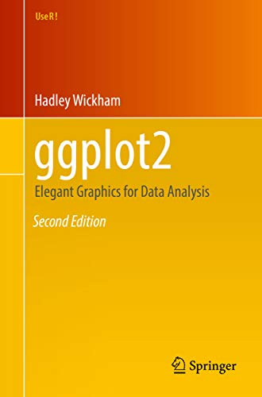

```{r setup, include=FALSE}
options(htmltools.dir.version = FALSE, max.print = 20)
knitr::opts_chunk$set(dev = 'svg',
                      out.width = "60%",
                      fig.align = "center",
                      message = FALSE,
                      warning = FALSE) # set output device to svg
devtools::load_all()
library(tidyverse)
```

class: inverse, center, middle

# Probabilità

---
# Le distribuzioni di probabilità in R

Ci sono tantissime distribuzioni implementate in R, e molte altre caricando specifici pacchetti. `t`, `norm`, `gamma`, `beta`, `poisson`, `exp`, `chisq`, `binom`, ...

--

Tutte queste distribuzioni possono essere combinate con 4 funzioni: `r`, `q`, `d` e `p`:

- `rnorm`: genera numeri da una distribuzione normale (molto utile per simulare dati)
- `dnorm`: calcola la densità di probabilità
- `pnorm`: calcola la probabilità cumulata dato un quantile
- `qnorm`: calcola il quantile data la probabilità cumulata

---
# Distribuzione Normale - `rnorm`

```{r, fig.width=7, fig.height=4, out.width="100%"}
par(mfrow = c(1,3))
d1 <- rnorm(n = 1000, mean = 100, sd = 5)
d2 <- rnorm(n = 1000, mean = 100, sd = 10)
d3 <- rnorm(n = 1000, mean = 100, sd = 50)
hist(d1, xlim = c(100-3*50, 100+3*50))
hist(d2, col = "lightblue", xlim = c(100-3*50, 100+3*50))
hist(d3, col = "salmon", xlim = c(100-3*50, 100+3*50))
```

---
# Distribuzione Normale - `rnorm`

Il parametro critico di `rnorm` è la numerosità. Più osservazioni generiamo più la nostra distribuzione è precisa.

```{r, echo = FALSE}
par(mfrow = c(1,3))
d1 <- rnorm(n = 10, mean = 0, sd = 1)
d2 <- rnorm(n = 100, mean = 0, sd = 1)
d3 <- rnorm(n = 100000, mean = 0, sd = 1)
xs <- seq(-4, 4, 0.001)
xd <- dnorm(xs, 0, 1)

hist(d1, xlim = c(-5, 5), main = "N = 10", freq = FALSE, ylim = c(0, 1))
lines(xs, xd, col = 2, lwd = 2)

hist(d2, col = "lightblue", xlim = c(-5, 5), main = "N = 100", freq = FALSE, ylim = c(0, 1))
lines(xs, xd, col = 2, lwd = 2)

hist(d3, col = "green", xlim = c(-5, 5), main = "N = 100000", freq = FALSE, ylim = c(0, 1))
lines(xs, xd, col = 2, lwd = 2)
```

---
# Distribuzione Normale - `pnorm`

Usiamo una la funzione `ggnorm` per rappresentare `pnorm()`

```{r}
ggnorm(q = 0.5, mean = 0, sd = 1, lower.tail = TRUE) # pnorm(0.5, 0, 1, TRUE)
```

---
# Distribuzione Normale - `pnorm`

Possiamo anche avere un'area delimitata da 2 quantili

```{r}
ggnorm(q = c(-1, 1), mean = 0, sd = 1, within = TRUE) # pnorm(1, 0, 1) - pnorm(-1, 0, 1)
```

---
# Distribuzione Normale - `pnorm`

Possiamo anche rappresentare il complementare

```{r, out.width="50%"}
ggnorm(q = c(-1, 1), mean = 0, sd = 1, within = FALSE) # pnorm(-1, 0, 1, lower.tail = TRUE) + pnorm(1, 0, 1, lower.tail = FALSE)
```

---
# Distribuzione Normale - `qnorm`

.font70[

`qnorm` è l'operazione complementare di `pnorm`. Se vogliamo sapere il quantile associato ad una certa probabilità comulata $p$ facciamo `qnorm(p, mean, sd)`

```{r, out.width="50%"}
cumprob <- 0.2 # da -Inf a q
q <- round(qnorm(cumprob, 0, 1), 2)

ggnorm(q = q, mean = 0, sd = 1)
```

]

---
# Distribuzione Normale - `dnorm`

.font70[

Con `dnorm` calcoliamo la densità di probabilità di un quantile. In termini pratici corrisponde all'asse $y$ dei nostri grafici:

```{r, out.width="50%"}
ggnorm(q = q, mean = 0, sd = 1) +
  geom_point(x = q, 
             y = dnorm(q, 0, 1), 
             size = 3, 
             col = "red")
```
]

---
class: inverse, center, middle

# Esercizi `r emo::ji("gear")`

---
# Esercizi `r emo::ji("gear")`

.font80[

Supponiamo che il punteggio X di un test sull’ansia segua una distribuzione normale con:

- media $\mu = 50$
- deviazione standard $\sigma = 6$

]

```{r, out.width="50%"}
ggnorm(mean = 50, sd = 6)
```

---
# Esercizi `r emo::ji("gear")`

Calcolare la probabilità che un soggetto scelto a caso abbia un punteggio:

1. inferiore a 45
2. superiore a 60
3. compreso tra 55 e 65
4. inferiore alla media meno una deviazione standard
5. superiore alla media più una deviazione standard
6. superiore alla media più 4 deviazioni standard

---
# Soluzioni

```{r}
mu <- 50
sigma <- 6
```

```{r}
pnorm(45, mu, sigma)
1 - pnorm(45, mu, sigma) # pnorm(45, mu, sigma, lower.tail = FALSE)
pnorm(65, mean=mu, sd=sigma) - pnorm(55, mean=mu, sd=sigma)
pnorm(mu - sigma, mean=mu, sd=sigma)
1 - pnorm(mu + sigma, mean=mu, sd=sigma)
```

---
# Esercizi `r emo::ji("gear")`

Calcolare la probabilità che un soggetto scelto a caso abbia un punteggio che non si
discosta dalla media più di

1. una deviazione standard
2. 2 deviazioni standard
3. 3 deviazioni standard

Calcolare

5. il 95-esimo percentile della distribuzione dei punteggi
6. il rango percentile associato a un soggetto che ha ottenuto un punteggio di 43

---
# Soluzioni

```{r}
a <- mu - sigma
b <- mu + sigma
pnorm(b, mean=mu, sd=sigma) - pnorm(a, mean=mu, sd=sigma)

a <- mu - 2*sigma
b <- mu + 2*sigma
pnorm(b, mean=mu, sd=sigma) - pnorm(a, mean=mu, sd=sigma)

a <- mu - 3*sigma
b <- mu + 3*sigma
pnorm(b, mean=mu, sd=sigma) - pnorm(a, mean=mu, sd=sigma)
```

---
# Soluzioni

```{r}
x <- qnorm(0.95, mean=mu, sd=sigma)
x
pnorm(x, mean=mu, sd=sigma)
p <- pnorm(43, mean=mu, sd=sigma)
round(p * 100,1)
qnorm(p, mean=mu, sd=sigma)
```

---
class: inverse, center, middle

# Punti Z

---
# Punti Z

.font70[

I punti Z si calcolano $z_i = \frac{x_i - \mu}{\sigma}$. Vediamo passo per passo: generiamo dei dati da una distribuzione normale con media $\mu = 100$ e deviazione standard $\sigma = 20$:

```{r}
dat <- data.frame(y = rnorm(100, 100, 20))
```

```{r, out.width="50%"}
ggplot(dat, aes(x = y)) +
  geom_histogram(bins = 20, color = "black", fill = "lightblue") +
  theme_minimal(base_size = 15)
```

]

---
# Punti Z

Prima sottraiamo la media da ogni valore $x_{cen} = x_i - \mu$. Se un valore è vicino alla media avrà un punteggio vicino a 0:

```{r, echo = FALSE}
dat$ycen <- with(dat, y - mean(y))
dat$id <- 1:nrow(dat)
dat$sign <- ifelse(dat$ycen > 0, "positive", "negative")


ggplot(dat, aes(y = y, x = id)) +
  geom_segment(aes(x = id, xend = id,
                   y = mean(dat$y), yend = y,
                   color = sign),
               show.legend = FALSE) +
  geom_point(size = 2) +
  geom_hline(yintercept = mean(dat$y)) +
  scale_y_continuous(
    sec.axis = sec_axis(~ . - mean(dat$y), name = "y - mean(y)")
  ) +
  scale_color_manual(values = c("red", "black")) +
  theme_minimal(base_size = 15)
```

---
# Punti Z

Poi calcoliamo e rappresentiamo la deviazione standard che è $\sigma = \sqrt{\frac{\sum_{i = 1}^N(x_i - \mu_x)^2}{N}}$ (la radice quadrata della media degli scarti al quadrato):

```{r, echo = FALSE}
ggplot(dat, aes(y = y, x = id)) +
  geom_segment(aes(x = id, xend = id,
                   y = mean(dat$y), yend = y,
                   color = sign),
               show.legend = FALSE) +
  geom_point(size = 2) +
  geom_hline(yintercept = mean(dat$y)) +
  scale_y_continuous(
    sec.axis = sec_axis(~ . - mean(dat$y), name = "y - mean(y)")
  ) +
  scale_color_manual(values = c("red", "black")) +
  theme_minimal(base_size = 15) +
  geom_hline(yintercept = mean(dat$y)) +
  geom_hline(yintercept = c(mean(dat$y) + sd(dat$y),
                            mean(dat$y) - sd(dat$y)),
             linetype = "dashed")
```

---
# Punti Z

Infine dividiamo ogni scarto dalla media per la deviazione standard $z_i = \frac{x_i - \mu}{\sigma}$. In questo modo uno scarto che è vicino alla deviazione standard prenderà il valore ~ 1 e così rapportato a tutte le distanze:

```{r, echo = FALSE}
ggplot(dat, aes(y = y, x = id)) +
  geom_segment(aes(x = id, xend = id,
                   y = mean(dat$y), yend = y,
                   color = sign),
               show.legend = FALSE) +
  geom_point(size = 2) +
  geom_hline(yintercept = mean(dat$y)) +
  scale_y_continuous(
    sec.axis = sec_axis(~ (. - mean(dat$y))/sd(dat$y), name = "(y - mean(y)) / sd(x)")
  ) +
  scale_color_manual(values = c("red", "black")) +
  theme_minimal(base_size = 15) +
  geom_hline(yintercept = mean(dat$y)) +
  geom_hline(yintercept = c(mean(dat$y) + sd(dat$y),
                            mean(dat$y) - sd(dat$y)),
             linetype = "dashed")
```

---
# Punti Z

Trasformare dei dati grezzi in punti z è un modo molto utile per interpretarli:

```{r}
mu <- 10
sigma <- 4
n <- 10

datz <- data.frame(
  id = 1:n,
  y = rnorm(n, mu, sigma)
)

datz
```

---
# Punti Z

Calcoliamo i punti z rispetto ai valori normativi con $z_i = \frac{x_i - \mu}{\sigma}$:

```{r}
datz$yz <- (datz$y - mu)/sigma
datz$yz
```

Come li interpretiamo?

---
class: extra-section, center, middle

# ggplot2

---
class: extra

# ggplot2

`ggplot2` è un pacchetto per creare grafici alternativo ai grafici di base estremamente potente (e divertente `r emo::ji("smile")`)

.pull-left[

```{r, echo = FALSE}
knitr::include_graphics("img/ggplot2.svg")
```

]

.pull-right[

```{r echo = FALSE}

```

]

---
# ggplot2

```{r, eval = FALSE}
# install.package("ggplot2")
library(ggplot2)
```

La logica è leggermente diversa rispetto ai grafici di base. Con `ggplot` si compongono i grafici a *strati* concatenando con `+`

.pull-left[
```{r}
plot(mtcars$mpg, mtcars$disp)
```
]

.pull-right[
```{r}
ggplot(mtcars, aes(x = mpg, y = disp)) +
  geom_point()
```
]

---
# ggplot2

Ma la potenza di `ggplot` si vede nella semplicità nel creare grafici complessi. Prendiamo i dati della lezione precedente:

```{r}
dat <- read.csv("../../data/psych.csv", header = TRUE, sep = ";") # importare
dat <- dat[complete.cases(dat), ]
```

Facciamo uno `scatterplot` della relazione tra `eta` e `depressione` per ogni `diagnosi` colorando in base al `ses`:

```{r, eval = FALSE}
ggplot(dat, aes(x = eta, y = dep_score, color = ses)) +
  geom_point() +
  facet_wrap(~diagnosi)
```

---
# ggplot2

```{r, echo=FALSE}
ggplot(dat, aes(x = eta, y = dep_score, color = ses)) +
  geom_point() +
  facet_wrap(~diagnosi)
```

---
# ggplot2

```{r}
ggplot(dat, aes(x = diagnosi, y = ans_score, fill = diagnosi)) + 
  geom_boxplot(show.legend = FALSE)
```

---
# ... ma molto altro! `r emo::ji("smile")`

- https://r-graph-gallery.com/ggplot2-package.html
- https://ggplot2-book.org/
- http://r-statistics.co/Complete-Ggplot2-Tutorial-Part1-With-R-Code.html


