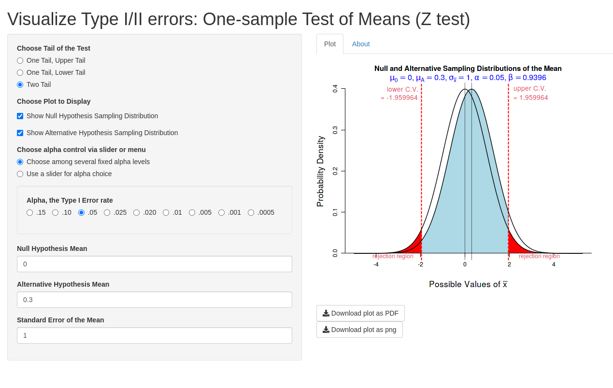
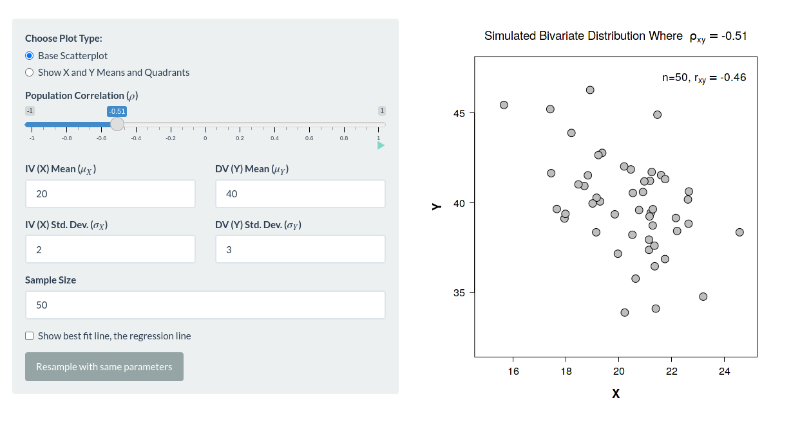

```{r setup, include=FALSE}
options(htmltools.dir.version = FALSE, max.print = 20)
knitr::opts_chunk$set(dev = 'svg',
                      out.width = "60%",
                      fig.align = "center") # set output device to svg
devtools::load_all()
library(tidyverse)
```

class: inverse, center, middle

# Inferenza, domande? 

---
# Inferenza - Punti fondamentali

--

- Campione e Popolazione --> Statistiche e Parametri

--

- Approccio Fisher
    - $H_0$
    - Statistica test
    - Distribuzione campionaria
    - $p$ value
    
--
    
- Test $z$

--

- Covarianza, Correlazione

---
# Neyman e Pearson

Per maggiore intuitività dei concetti di *type-1/2 errors*, *potenza*, etc. c'è una web-app molto interessante [https://shiny.rit.albany.edu/stat/betaprob/](https://shiny.rit.albany.edu/stat/betaprob/)

```{r}

```

---
class: inverse, center, middle

# Test $Z$ Esercizi 

---
# Esercizio

Il manuale di un test per la **depressione** indica che la popolazione *normativa* ha valori $\mu = 30$ e $\sigma = 8$:

- Generare diversi campioni di $n = 30$ soggetti da una distribuzione normale con:
    - `x1`: $\mu = 30$ e $\sigma = 8$
    - `x2`: $\mu = 40$ e $\sigma = 10$
    - `x3`: $\mu = 30$ e $\sigma = 2$
    
- Calcolare *media* e *deviazione standard* dei campioni generati
- Rappresentare graficamente i 3 campioni
- Assumendo $\alpha = 0.05$ eseguire uno $z$ test di ognuno dei campioni rispetto alla popolazione. Per il primo calcolate *a mano* lo $z$ test, per gli altri usate la funzione `Ztest`
- Intepretare e descrivere i risultati

---
# Soluzioni

```{r}
# salviamo i valori normativi
mu <- 30
sigma <- 8
n <- 30

# generiamo i dati
x1 <- rnorm(n, 30, 8)
x2 <- rnorm(n, 40, 10)
x3 <- rnorm(n, 30, 2)

# calcoliamo media e deviazione standard
mean_sd <- function(x){
  c(media = mean(x), sd = sd(x))
}

lapply(list(x1 = x1, x2 = x2, x3 = x3), mean_sd)
```

---
# Soluzioni

```{r}
dat <- data.frame(test = c(x1, x2, x3), sample = rep(c("x1", "x2", "x3"), each = n))
ggplot(dat, aes(x = sample, y = test, fill = sample)) +
  geom_hline(yintercept = mu, linetype = "dashed") +
  geom_boxplot(show.legend = FALSE) +
  theme_minimal(base_size = 20)
```

---
# Soluzioni

```{r}
zoss <- (mean(x1) - mu)/(sigma/sqrt(length(x1))) # statistica test
pvalue <- pnorm(-abs(zoss))*2 # p value
pvalue # conclusioni?

Ztest(mean(x2), length(x2), mi = mu, sigma = sigma)
Ztest(mean(x3), length(x3), mi = mu, sigma = sigma)
```

---
# Beyond the p value...

Il p value non è l'unica informazione importante quando si intepreta il risultato di un test. Prendiamo due condizioni:

```{r}
x1 <- rnorm(50, mean = 35, sd = 10)
x2 <- rnorm(50, mean = 45, sd = 10)
dat <- data.frame(test = c(x1, x2), group = rep(c("x1", "x2"), each = 50))
```

```{r, echo = FALSE}
boxplot(test ~ group, data = dat)
abline(h = mu, col = "red")
```

---
# Beyond the p value...

```{r}
Ztest(mean(x1), length(x1), mi = mu, sigma = sigma)
Ztest(mean(x2), length(x2), mi = mu, sigma = sigma)
```

In entrambi i casi il p value è significativo e molto piccolo. Ma la differenza è molto diversa in `x1` rispetto ad `x2`. E' sempre importante quindi guardare i dati e analizzare la grandezza dell'effetto (oltre al p value)

---
class: inverse, center, middle

# Covarianza e Correlazione

---

# Covarianza e Correlazione

Anche qui una mitica web-app è molto utile per visualizzare la relazione tra due variabili cambiando vari parametri [https://shiny.rit.albany.edu/stat/rectangles/](https://shiny.rit.albany.edu/stat/rectangles/)

```{r, echo = FALSE}

```

---
# `rcorr` e `plotcorr`

Con la funzione `rcorr` e `plotcorr` potete generare due vettori numerici con una data correlazione e rappresentarli graficamente. Il principio è lo stesso di `rnorm` ma potete simulare una relazione *bivariata*:

```{r}
cor0.7 <- rcorr(mux = 0, muy = 0, n = 100, sdx = 1, sdy = 1, r = 0.7)

# analisi univariate
summary(cor0.7$x)
summary(cor0.7$y)

# relazione bivariata
cor(cor0.7$x, cor0.7$y)
```

---
# `rcorr` e `plotcorr`

Facciamo i grafici univariati

```{r, out.width="50%"}
par(mfrow = c(1, 2))
hist(cor0.7$x)
hist(cor0.7$y)
```

---
# `rcorr` e `plotcorr`

Questa è la relazione bivariata

```{r}
plotcorr(cor0.7, marginal = TRUE)
```

---
class: inverse, center, middle

# Correlazione Esercizi 

---
# Correlazione Esercizi

- Generare un dataset (chiamato `dat`) usando la funzione `rcorr` con:
    - $\mu_1 = 10$, $\mu_2 = 50$
    - $\sigma_1 = 4$, $\sigma_2 = 10$
    - $\rho = 0.4$
    - $n = 50$
- Calcolare le statistiche descrittive e rappresentare graficamente le variabili in modo univariato
- Rappresentare le variabili in modo bivariato
- Usare le formule per calcolare manualmente la `covarianza` e la `correlazione`. Confrontare il risultato con le funzioni `cov` e `cor`
- Applicare il `cor.test` e intepretare il risultato

---
# Formule

## Covarianza

$$cov_{x,y} = \frac{\sum_{i=1}^{N}(x_{i}-\bar{x})(y_{i}-\bar{y})}{N-1}$$


## Correlazione

$$\rho_{x,y} = \frac{cov_{x,y}}{\sigma_x\sigma_y}$$

---
# Soluzioni

```{r}
dat <- rcorr(mux = 10, muy = 50, sdx = 4, sdy = 10, n = 50, r = 0.4)

rsummary(dat$x)
rsummary(dat$y)
```

---
# Soluzioni

```{r}
par(mfrow = c(1, 2))
boxplot(dat$x)
boxplot(dat$y)
```

---
# Soluzioni

```{r}
plotcorr(dat, marginal = TRUE)
```

---
# Soluzioni

```{r}
# covarianza a mano
cov_xy <- with(dat, sum((x - mean(x)) * (y - mean(y)))/(length(x) - 1))
cov_xy
cov(dat$x, dat$y)

# correlazione
cov_xy / (sd(dat$x) * sd(dat$y))
cor(dat$x, dat$y)
```

---
# Soluzioni

```{r}
# test
cor.test(dat$x, dat$y)
```

Che conclusioni possiamo trarre?
